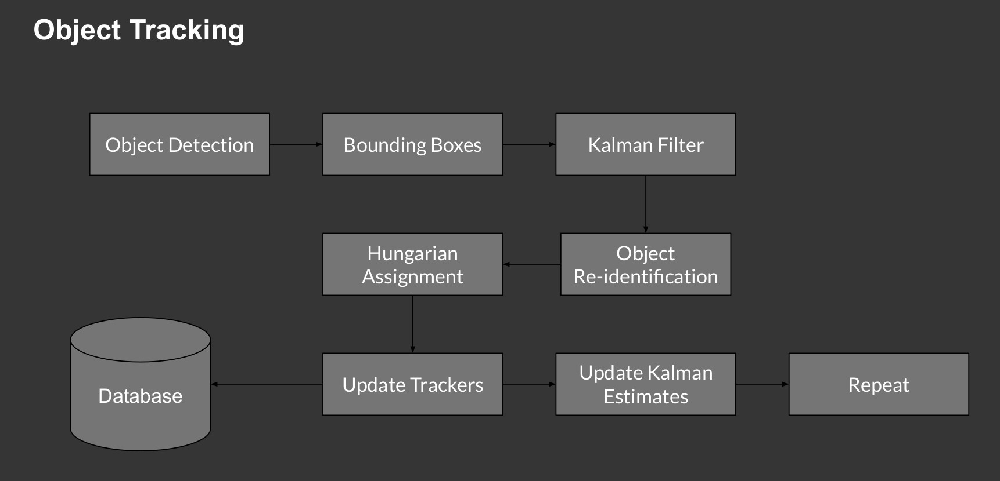

# Video Analytics for traffic intelligence 

Supports:

- Object Detection

- Object Tracking

## How to use the repo

1. Create dirs: 
  - `model` : For storing `model.weight` and `model.cfg`
  - `data`  : For storing the footage to be analysed
  - `result`: For saving inferences with bounding boxes

2. Run `json_maker.py` for storing the inferences on a video feed in the file called `detection.json`

3. Run `demo.py` to use these detection on the video feed and store the inferences in `result`

4. Run `create_video.py` to stitch the images from `result` into a video file.

To do:
- Create end-to-end detection and tracking pipeline
- Integrate MongoDB as database
- Create deterministic logic for video analytics 